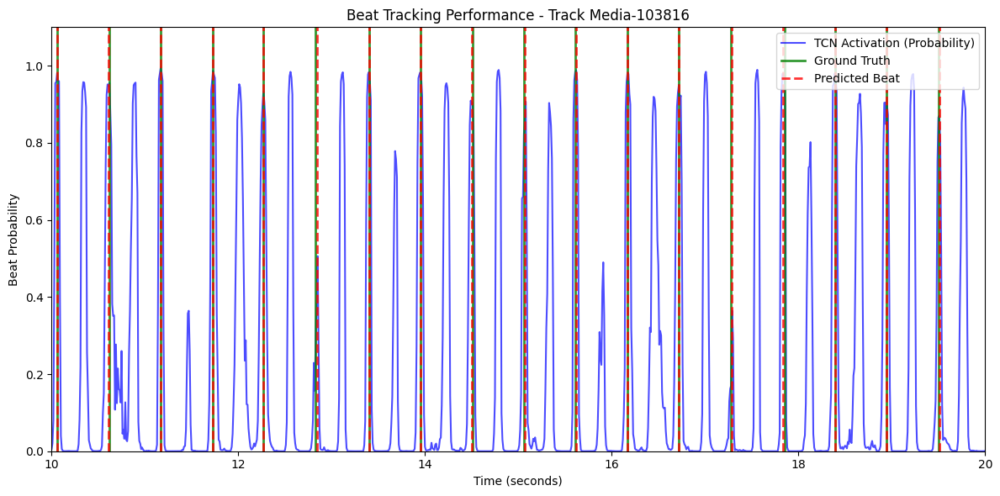

# Beat Tracking with a Temporal Convolutional Network

A PyTorch re-implementation of a TCN-based beat tracker for the Ballroom dataset, inspired by Davies & Böck (2019), *Temporal Convolutional Networks for Musical Audio Beat Tracking*.

The model is small (~21,800 parameters) and trains end-to-end from log-CQT spectrograms to per-frame beat probabilities. A dynamic-programming sequence decoder then converts the activation into a globally consistent beat sequence.

## Results

Evaluated on the held-out 20% test split of the Ballroom dataset (140 of 698 tracks), using the standard `mir_eval.beat` suite:

| Metric              | Score |
| ------------------- | :---: |
| **F-measure**       | 0.831 |
| **AMLt**            | 0.923 |
| CMLc                | 0.690 |
| CMLt                | 0.787 |
| AMLc                | 0.788 |
| Information Gain    | 1.95  |



> Blue: TCN beat-activation probability over time. Green solid lines: ground-truth beats. Red dashed lines: predicted beats.

## Approach

| Stage | What it does | Why |
| --- | --- | --- |
| **Feature extraction** | 81-band log-magnitude CQT, `fmin=30 Hz`, 10 ms hop | CQT's logarithmic frequency spacing matches musical perception better than a linear STFT and gives the front-end conv layers structured input. |
| **Pre-computation** | Each track's CQT and beat targets are saved to `.pt` files once | `librosa.cqt` is CPU-bound (~3-5 s per track). Caching eliminates the bottleneck so the GPU stays busy during training. |
| **Front-end** | 2D conv stack ending with a vertical pool that collapses the frequency axis | Lets the model learn time × frequency patterns (kicks, snares, vocal onsets) before reducing to a 1D sequence. |
| **TCN body** | 4 dilated 1D convs, dilations `[1, 2, 4, 8]`, residual connections | Receptive field large enough to span several beats at typical Ballroom tempi. |
| **Loss** | `BCEWithLogitsLoss(pos_weight=30)` on Gaussian-widened targets | Beat frames are <5% of all frames; without `pos_weight` the model trivially predicts "no beat" everywhere. The widened targets (1.0 at beat, 0.5 ±2 frames) make training tolerant of 1-frame timing jitter. |
| **Decoder** | `librosa.beat.beat_track` on the activation curve | Dynamic programming finds a globally consistent tempo and beat sequence, fixing local activation errors. |

Full details — including assumptions, evaluation protocol, and a discussion of failure modes — are in [`report.pdf`](report.pdf).

## Repository layout

```
beat-tracking-tcn/
├── beat_tracking_tcn.ipynb   # Self-contained notebook (data prep → train → evaluate → visualise)
├── tcn_beat_tracker.pth      # Trained model weights (~45 KB)
├── final_visualization.png   # Sample prediction overlay
├── report.pdf                # 5-page coursework report
└── README.md
```

## How to run

### 1. Install dependencies

```bash
pip install torch librosa numpy scipy mir_eval mirdata matplotlib jupyter
```

### 2. Get the data

The Ballroom dataset is downloaded automatically by [`mirdata`](https://mirdata.readthedocs.io/) on first use:

```python
import mirdata
ballroom = mirdata.initialize("ballroom")
ballroom.download()
```

### 3. Inference only — use the pre-trained model

Open the notebook and run cells 0–4 (imports, feature extraction, model, `beatTracker`). Then:

```python
from pathlib import Path
beats, downbeats = beatTracker("/path/to/audio.wav")
```

`tcn_beat_tracker.pth` must live in the same directory as the notebook for the loader to find it.

### 4. Reproduce training + evaluation from scratch

Open the notebook and run all cells. The full pipeline (download → pre-compute → train 50 epochs → evaluate → visualise) takes roughly 30 min for pre-computation plus 30 min of training on CPU. With CUDA the training step is significantly faster.

## Credits

Coursework 1 for **ECS7006 Music Informatics**, MSc Sound and Music Computing, Queen Mary University of London (2026).

The architecture is based on:

> Davies, M. E. P., & Böck, S. (2019). *Temporal Convolutional Networks for Musical Audio Beat Tracking.* European Signal Processing Conference (EUSIPCO).
